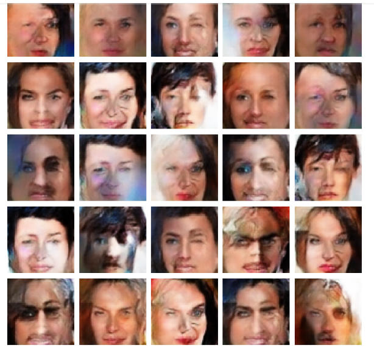

## :dart: _A mini project for implementing *GAN* Network by using light version of [celebA](https://s3.amazonaws.com/video.udacity-data.com/topher/2018/November/5be7eb6f_processed-celeba-small/processed-celeba-small.zip) dataset._
---

>
>
>
>
>
>
>
>

>
>
>
>
>
>
>
>

### *_Generator_ and _Discriminator_ network.*
---
>
>
>
>
>

>
>
>
>
>
### *steps of Training a GAN Network.*
---
- Import Library
- Set Hyperparameters
- Load Data
- Generator
- Discriminator
- Compile Models
- Train Model

### _result after 50 epoch training_.
---

